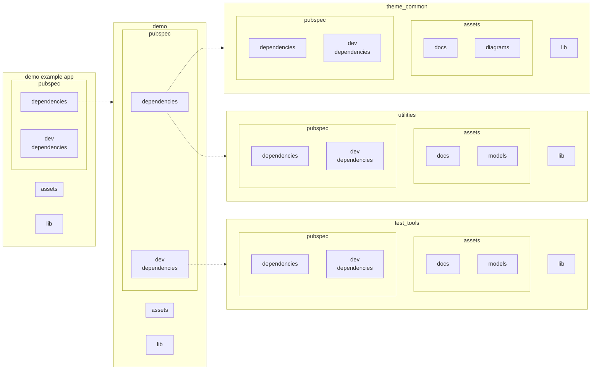

# This demonstrates reading the manifest file to find assets in included packages

* test_tools an assets package that should be included only in dev scope
* utilities an assets package
* theme_common an assets package

## Caveat

Assets that are added via pubspec.yaml are copied into a location that is used to populate the assets.
That location may not be cleared when referencing the package via relative location from the demo pubspect.yaml.
This means that assets removed from the included pubspec.yaml may still appear in the AssetManifest until some type of clean operation occurs.

## Project structure

This project contains references from the demo to the three other packages. One of those packages is only used in tests.  `theme_common`, `utilities` and `test_tools` have their own assets that become available to any program or package that takes them as a dependency.  `test_tools` are only available to the demo tests because they are only part of `dev_dependencies`.  The assets in `theme_common` and `utilities` area available to both tests and the program because they are brought in via `dependencies` in the `pubspec.yaml`.

### pubspec.yaml

* [demo](packages/demo/pubspec.yaml)
  * [demo/example](packages/demo/example/pubspec.yaml)
* [test_tools](packages/test_tools/pubspec.yaml)
* [theme_common](packages/theme_common/pubspec.yaml)
* [utilities](packages/utilities/pubspec.yaml)

## Dependencies



## Assets visible to applications and libraries

Applications and packages see everything refenrenced in `dependencies:` in `pubspec.yaml`

```yaml
dependencies:
  flutter:
    sdk: flutter
  utilities:
    path: ../utilities
  theme_common:
    path: ../theme_common
```

The demo application sees assets transitively brought in from library packages packages but does not see the tools_assets.

```json
[
    "packages/cupertino_icons/assets/CupertinoIcons.ttf",

    "packages/theme_common/assets/diagrams/draw201.vsdx",
    "packages/theme_common/assets/docs/doc201.md",
    "packages/theme_common/assets/docs/doc202.md",

    "packages/utilities/assets/docs/doc101.md",
    "packages/utilities/assets/docs/doc102.md",
    "packages/utilities/assets/models/model101.json",

    "packages/utilities/lib/resources/icon101.png",
    "packages/utilities/lib/resources/libassets.json"
]
```

Files in lib will be packaged up with the app but they only appear to the AssetManager if you add them to the assets in `pubspec.yaml`. You must add them to the asset list if you want them to be picked up by AssetManager or show up in the AssetManifest.

## Assets visible to tests

Tests see everythining in `pubspec.yaml` that is scoped to `dependencies` or to `dev_dependencies`.  Tests can use the test_tools assets that are scoped to the tests in `pubspec.yaml`

```yaml
dependencies:
  flutter:
    sdk: flutter
  utilities:
    path: ../utilities
  theme_common:
    path: ../theme_common

dev_dependencies:
  flutter_test:
    sdk: flutter
  flutter_lints: ^2.0.0
  test_tools:
    path: ../test_tools
```

We can see this when interrogating for available assets.

```json
[
    "packages/test_tools/assets/docs/sample301.md",
    "packages/test_tools/assets/models/meta301.json",
    "packages/test_tools/assets/models/template301.json",

    "packages/theme_common/assets/diagrams/draw201.vsdx",
    "packages/theme_common/assets/docs/doc201.md",
    "packages/theme_common/assets/docs/doc202.md",

    "packages/utilities/assets/docs/doc101.md",
    "packages/utilities/assets/docs/doc102.md",
    "packages/utilities/assets/models/model101.json",

    "packages/utilities/lib/resources/icon101.png",
    "packages/utilities/lib/resources/libassets.json"
]
```

## Non code files in /lib

Files in lib will be packaged up with the app but they only appear to the AssetManager if you add them to the assets in `pubspec.yaml`. You must add them to the asset list if you want them to be picked up by AssetManager or show up in the AssetManifest.
